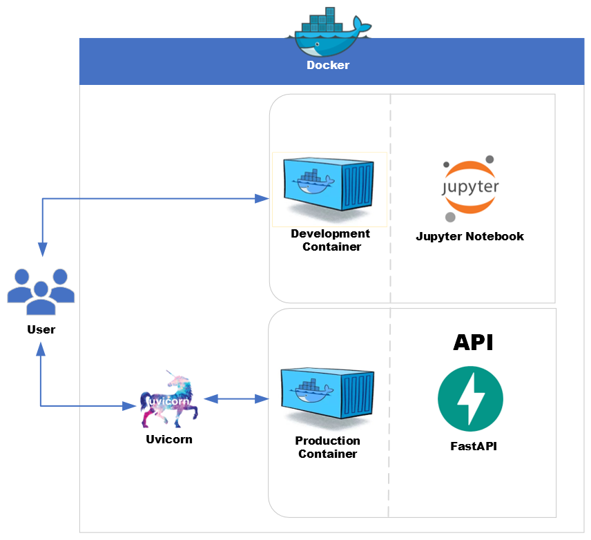

## 🧰 How to Use This Template    

Click the green **"Use this template"** button at the top of the page, then choose **"Create a new repository"**.   

This will create your own copy of this project, which you can modify freely — no need to fork!   

---    

<div align="center">
    
</div>

# ML API with FastAPI and Docker

- ML Engineering best practices
- ML model deployment as a FastAPI service, containerized with Docker for scalability and reproducibility

---

- $\textcolor{#FF4500}{\text{You can easily adapt the repository to work with any dataset of your choice.}}$
- The structure is flexible and can be applied to various machine learning models, including $\textcolor{#1E90FF}{\text{regression, classification, and clustering}}$.

---

***Table of Contents***

<details>
  <summary><a href="#1-about-this-repository"><i><b>1. About this Repository</b></i></a></summary>
  <div>
              <a href="#11-who-is-this-project-for">1.1. Who Is This Project For?</a><br>
              <a href="#12-what-will-you-learn">1.2. What Will You Learn?</a><br>
              <a href="#13-prerequisites">1.3. Prerequisites</a><br>
              <a href="#14-contents-of-this-repository">1.4. Contents of this Repository</a><br>
  </div>
</details>

<details>
  <summary><a href="#2-project-structure"><i><b>2. Project Structure</b></i></a></summary>
  <div>
              <a href="#21-production-environment-dockerization">2.1. Production Environment (Dockerization)</a><br>
              <a href="#22-machine-learning-components">2.2. Machine Learning Components</a><br>
              <a href="#23-testing-components">2.3. Testing Components</a><br>
  </div>
</details>

<div>
      <a href="#3-project-files-and-folders-overview"><i><b>3. Project Files and Folders Overview</b></i></a>
</div>

<details>
  <summary><a href="#4-how-to-use-and-test-the-project"><i><b>4. How to Use and Test the Project</b></i></a></summary>
  <div>
              <a href="#41-build-and-start-the-containers">4.1. Build and Start the Containers</a><br>
              <a href="#42-train-the-model">4.2. Train the Model</a><br>
              <a href="#43-run-the-tests">4.3. Run the Tests</a><br>
              <a href="#44-test-the-fastapi-endpoints">4.4. Test the FastAPI Endpoints</a><br>
              <a href="#45-use-jupyter-for-development">4.5. Use Jupyter for Development</a><br>
  </div>
</details>

<div>
      <a href="#5-summary"><i><b>5. Summary</b></i></a>
</div>

<div>
      <a href="#6-for-additional-questions"><i><b>6. For Additional Questions</b></i></a>
</div>

# 1. About this Repository

This project demonstrates an end-to-end ML engineering workflow. You can train any machine learning model, serve it using a FastAPI application, and experiment interactively with Jupyter Notebook – all within Docker containers. The project is designed to be reproducible and maintainable.

## 1.1. Who Is This Project For?

This project is designed for anyone interested in machine learning, API development, or containerization with Docker. Whether you're a student, developer, or data scientist, this resource will guide you through building and deploying a machine learning API using FastAPI and Docker.

## 1.2. What Will You Learn?

By the end of this project, you will:
Develop a foundational understanding of FastAPI and its setup.

- Learn the basics of containerizing applications using Docker.
- Explore how to train and deploy simple machine learning models.
- Work with practical examples to build scalable APIs.
- Gain insights into integrating machine learning models into web services.
  This project serves as a well-organized example to help you learn about building ML APIs with FastAPI and Docker.

## 1.3. Prerequisites

This project is suitable for three types of learners:

1. **For those familiar with Docker and FastAPI**: You can dive straight into the deployment phase. The examples and configurations provided will help you enhance your skills and explore best practices in building and deploying APIs.
2. **For those who know Docker but are new to FastAPI**: This project will introduce you to FastAPI, guiding you through building and deploying a simple API. By the end, you'll be ready to integrate more complex models.
3. **For beginners with no prior knowledge of Docker or FastAPI**: This project is designed with you in mind. You'll start with the basics, learning how to set up Docker and FastAPI, and then move on to building and deploying a machine learning model. The repository is well-organized and clear, allowing you to easily tweak it for your needs and learn effectively from practical examples.

## 1.4. Contents of this Repository

```
Folder PATH listing
.
+---app                         <-- Contains the main application code
|       main.py                 <-- Main application logic
|       __init__.py             <-- Initializes the app module
|       README.md               <-- Documentation for the app module
|
+---assets                      <-- Contains static assets (images, styles, etc.)
|       logo.png                <-- Project logo image
|       README.md               <-- Documentation for assets
|
+---data                        <-- Directory for storing datasets
|       original_dataset.csv    <-- Example dataset for model training
|       README.md               <-- Documentation for the dataset
|
+---docker                      <-- Contains Docker configuration files
|       Dockerfile.api          <-- Dockerfile for building the API service
|       Dockerfile.jupyter      <-- Dockerfile for setting up Jupyter Notebook
|       entrypoint.sh           <-- Shell script for automatic dependency installation
|       README.md               <-- Documentation for Docker setup
|
+---models                      <-- Stores trained machine learning models
|       ml_model.pkl            <-- Serialized ml model
|       README.md               <-- Documentation for models
|
+---notebooks                   <-- Jupyter notebooks for experiments and analysis
|       data_exploration.ipynb  <-- Notebook for data exploration
|       train_dev.ipynb         <-- Notebook for training and development
|       README.md               <-- Documentation for notebooks
|
+---scripts                     <-- Contains utility scripts
|       train.py                <-- Script for training models
|       README.md               <-- Documentation for scripts
|
+---tests                       <-- Contains automated tests
|       __init__.py             <-- Initializes the tests package
|       README.md               <-- Tests documentation
|       test_api.py             <-- API endpoint tests
|
|   .dockerignore               <-- Specifies files to ignore in Docker builds
|   .gitignore                  <-- Specifies files to ignore in Git version control
|   docker-compose.yml          <-- Docker Compose configuration
|   LICENSE                     <-- License information for the project
|   README.md                   <-- Project overview and instructions
|   requirements.txt            <-- Lists Python dependencies
```

# 2. Project Structure

## 2.1. Production Environment (Dockerization)

- **Dockerfile.api**: Dockerfile for building the FastAPI container. It installs the dependencies required for serving the model in a production environment.
- **Dockerfile.jupyter**: Dockerfile for building the Jupyter Notebook container. It installs additional dependencies for interactive development and experimentation.
- **entrypoint.sh**: Shell script that automatically checks and installs any missing packages from requirements.txt when containers start.
- **docker-compose.yml**: Defines two services:

  - `api`: Runs the FastAPI application for production, exposing it on port `8000`.
  - `jupyter`: Runs a Jupyter Notebook server for development and model training, accessible on port `8888`.

  Note: The project uses a volume mount `.:/app` where:

  - `app/` (Python): Your local project's Python application directory containing the FastAPI code
  - `/app` (Docker): The container mount point where your code is accessible inside Docker

  This is a standard Docker practice where the Python application directory is mounted to a consistent location in the container.

## 2.2. Machine Learning Components

- **requirements.txt**Lists all the Python dependencies, including NumPy, pandas, scikit-learn, FastAPI, and others.
- **train.py**A training script that loads a preprocessed dataset, which can be replaced with any dataset of your choice, trains the machine learning model, evaluates its performance, and saves the trained model as `ml_model.pkl`. The structure is designed to be adaptable for various machine learning tasks, including regression, classification, and clustering.
- **app/main.py**The FastAPI application that loads `ml_model.pkl` and exposes two endpoints:

  - `/health`: Returns a simple health check.
  - `/predict`: Accepts a JSON payload with features and returns the model's prediction.

## 2.3. Testing Components

- **tests/**Contains automated tests for the API endpoints:
  - Unit tests for health check endpoint
  - Unit tests for prediction endpoint
  - Error handling tests
  - Documentation for writing and running tests

# 3. Project Files and Folders Overview

- **app/**Contains the main application code:

  - **main.py:** Main application logic for FastAPI.
  - **__init__.py:** Initializes the app module.
  - **README.md:** Documentation for the app module.
- **assets/**Contains static assets like images and styles:

  - **logo.png:** Project logo image.
  - **README.md:** Documentation for assets.
- **data/**Directory for storing datasets used in the project:

  - **original_dataset.csv:** Example dataset for model training.
  - **README.md:** Documentation for the dataset.
- **docker/**Contains Docker configuration files:

  - **Dockerfile.api:** Builds the FastAPI container.
  - **Dockerfile.jupyter:** Builds the Jupyter Notebook container.
  - **entrypoint.sh:** Automatically installs missing dependencies on container startup.
  - **README.md:** Documentation for Docker setup.
- **models/**Stores trained machine learning models:

  - **ml_model.pkl:** Serialized machine learning model.
  - **README.md:** Documentation for models.
- **notebooks/**Jupyter notebooks for experiments and analysis:

  - **train_dev.ipynb:** Notebook for training and development.
  - **data_exploration.ipynb:** Notebook for data exploration.
  - **ml_model.pkl:** Serialized model copy.
  - **README.md:** Documentation for notebooks.
- **scripts/**Contains utility scripts:

  - **train.py:** Script for training machine learning models.
  - **README.md:** Documentation for scripts.
- **tests/**Contains automated tests and test documentation:

  - **__init__.py:** Initializes the tests package.
  - **test_api.py:** Tests for API endpoints.
  - **README.md:** Documentation for tests.
- **.dockerignore:**Specifies files and directories to be ignored by Docker during the build process.
- **.gitignore:**Specifies files and directories to be ignored by Git version control.
- **LICENSE:**Contains the license information for the project.
- **README.md:**Provides an overview of the project, including setup instructions and documentation.
- **docker-compose.yml:**Defines services, port mappings, and volume mounting for the FastAPI and Jupyter containers.
- **requirements.txt:**Lists all the Python dependencies required for both model training and serving.
- **tree.txt:**A text representation of the directory structure.

# 4. How to Use and Test the Project

## 4.1. Build and Start the Containers

Open a terminal in the project directory and run:

```bash
docker-compose up --build -d
```

This command builds the images for both FastAPI and Jupyter services and starts them in detached mode.

## 4.2. Train the Model

1. To open a shell in the Jupyter container:

   ```bash
   docker-compose exec jupyter bash
   ```
2. Inside the container, run the training script:

   ```bash
   python scripts/train.py
   ```

   The script will:

   - Load the dataset
   - Train the machine learning model
   - Log the model's accuracy
   - Save the model as `models/ml_model.pkl`

## 4.3. Run the Tests

To run the automated tests:

```bash
docker-compose exec api pytest tests/
```

The tests verify:

- Health check endpoint
- Root endpoint
- Prediction endpoint with valid data
- Error handling for invalid inputs

## 4.4. Test the FastAPI Endpoints

1. **API Documentation:**
   FastAPI provides interactive API documentation:

   - Swagger UI: [http://localhost:8000/docs](http://localhost:8000/docs)
   - ReDoc: [http://localhost:8000/redoc](http://localhost:8000/redoc)

   These pages provide:

   - Interactive endpoint testing
   - Request/response schemas
   - Example values
   - Error responses
2. **Health Check:**Open your browser and go to [http://localhost:8000/health](http://localhost:8000/health). You should see:

   ```json
   {"status": "ok"}
   ```
3. **Prediction Endpoint:**Send a POST request to [http://localhost:8000/predict](http://localhost:8000/predict) with a JSON body. The model predicts Iris flower species based on the following measurements (in centimeters):

   - sepal_length: Length of the sepal
   - sepal_width: Width of the sepal
   - petal_length: Length of the petal
   - petal_width: Width of the petal

   The prediction returns a class number that corresponds to:

   - 0: Iris setosa
   - 1: Iris versicolor
   - 2: Iris virginica

   **Possible Responses:**

   - 200 OK: Successful prediction

   ```json
   {
       "status": "success",
       "prediction": 0,
       "input_features": [5.1, 3.5, 1.4, 0.2]
   }
   ```

   - 422 Unprocessable Entity: Invalid input data

   ```json
   {
       "detail": [
           {
               "loc": ["body", "sepal_length"],
               "msg": "value is not a valid float",
               "type": "type_error.float"
           }
       ]
   }
   ```

   - 500 Internal Server Error: Server-side error (e.g., model loading failed)

   ```json
   {
       "status": "error",
       "message": "Internal server error"
   }
   ```

   Examples for each species:

   **Example 1 - Iris setosa:**

   ```bash
   curl -X POST "http://localhost:8000/predict" \
        -H "Content-Type: application/json" \
        -d '{
            "sepal_length": 5.1,
            "sepal_width": 3.5,
            "petal_length": 1.4,
            "petal_width": 0.2
        }'
   ```

   Response:

   ```json
   {
       "status": "success",
       "prediction": 0,
       "input_features": [5.1, 3.5, 1.4, 0.2]
   }
   ```

   **Example 2 - Iris versicolor:**

   ```bash
   curl -X POST "http://localhost:8000/predict" \
        -H "Content-Type: application/json" \
        -d '{
            "sepal_length": 6.4,
            "sepal_width": 2.9,
            "petal_length": 4.3,
            "petal_width": 1.3
        }'
   ```

   Response:

   ```json
   {
       "status": "success",
       "prediction": 1,
       "input_features": [6.4, 2.9, 4.3, 1.3]
   }
   ```

   **Example 3 - Iris virginica:**

   ```bash
   curl -X POST "http://localhost:8000/predict" \
        -H "Content-Type: application/json" \
        -d '{
            "sepal_length": 7.7,
            "sepal_width": 3.8,
            "petal_length": 6.7,
            "petal_width": 2.2
        }'
   ```

   Response:

   ```json
   {
       "status": "success",
       "prediction": 2,
       "input_features": [7.7, 3.8, 6.7, 2.2]
   }
   ```

   Note: These examples use typical measurements for each species. The model makes predictions based on the patterns it learned from the training data.

## 4.5. Use Jupyter for Development

You have two options to work with the Jupyter notebooks:

1. **Through VS Code (Recommended):**
   - Open VS Code and press `Ctrl+Shift+P` (Windows/Linux) or `Cmd+Shift+P` (Mac)
   - Select "Dev Containers: Attach to Running Container..."
   - Choose the container named `p1-ml-engineering-api-fastapi-docker-jupyter-1`
   - A new VS Code window will open connected to the container
   - In VS Code, click "Open Folder". Then, in the top box, you will see `/root`. Delete `root` to see `app`. Finally, select the `app` folder to see all your project files
   - In VS Code, ensure you have the following extensions installed: `Docker`, `Dev Containers`, `Python`, `Jupyter`.
   - You can now work with notebooks directly in VS Code with all dependencies available. When opening a notebook, VS Code will prompt you to select a kernel. Choose the kernel named `Jupyter Container` which is automatically created in the container.    
   - If `Jupyter Container` does not appear automatically, click `Select Kernel` and choose `Jupyter Kernel`. The `Jupyter Container` option should then become available.
   - Alternatively, you can select the Python kernel that shows the `/usr/local/bin/python` path and Python version matching the one specified in your Dockerfile. If multiple kernels appear, always select the one with the container name or showing the container path (`/usr/local/bin/python`).

2. **Through Web Browser:**
   - Open your browser and navigate to [http://localhost:8888](http://localhost:8888)
   - All required dependencies are already installed
   - Changes are automatically saved to your local files through Docker volumes

3. **Running Python Scripts in VS Code Container:**
   - Open any Python script in the VS Code editor
   - In the VS Code terminal (which is already inside the container), run your script:
     ```bash
     python scripts/train.py
     ```
   - You should see the expected output from your script

The provided notebooks are:
- `notebooks/data_exploration.ipynb`: Explore the Iris dataset
- `notebooks/train_dev.ipynb`: Develop and train the model

Note: When working through VS Code, you're actually working inside the container where all dependencies are already installed. This ensures consistency between development and production environments.

4. **When You're Done:**
   To stop and remove the containers, run:
   ```bash
   docker-compose down
   ```

5. **Rebuilding After Changes:**
   If you've made changes to the Dockerfiles or docker-compose.yml, rebuild the containers:
   ```bash
   docker-compose down
   docker-compose build
   docker-compose up -d
   ```
   This ensures all changes take effect, including the custom Jupyter kernel installation.

# 5. Summary

- **Development and Production Together:**Train your model in the Jupyter container, then serve predictions using FastAPI in a separate container. Both containers share the same code and model files via Docker volumes.
- **Reproducibility:**Using Docker Compose ensures a consistent and easily configurable environment, allowing for seamless transitions between development and production.
- **Testing:**
  Verify the application's functionality using the provided endpoints for health checks and predictions, ensuring reliability and performance.

# 6. For Additional Questions

If you have any questions or suggestions, feel free to reach out to [Mostafa Rezaee](https://www.linkedin.com/in/mostafa-rezaee/) at Linkedin. You can also open an issue on the project repository.
